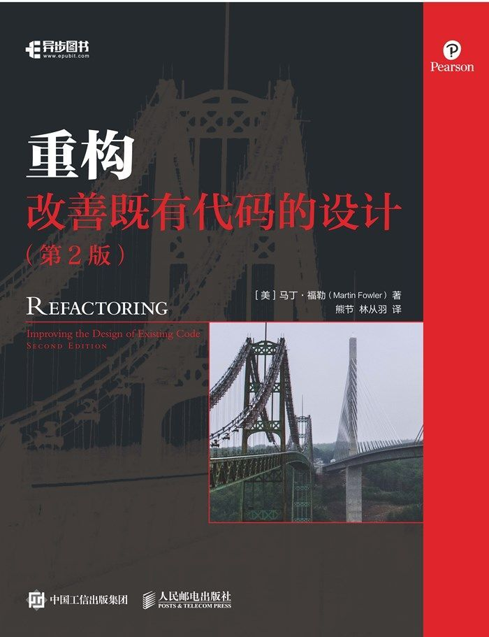

# 目录

- [第 1 章 重构，第一个示例](ch1.md)
- [第 2 章 重构的原则](ch2.md)
- [第 3 章 代码的坏味道](ch3.md)
- [第 4 章 构筑测试体系](ch4.md)
- [第 5 章 介绍重构名录](ch5.md)
- [第 6 章 第一组重构](ch6.md)
- [第 7 章 封装](ch7.md)
- [第 8 章 搬移特性](ch8.md)
- [第 9 章 重新组织数据](ch9.md)
- [第 10 章 简化条件逻辑](ch10.md)
- [第 11 章 重构 API](ch11.md)
- [第 12 章 处理继承关系](ch12.md)
