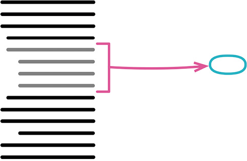
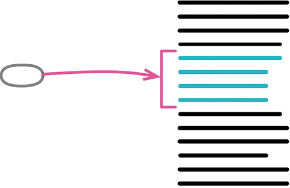
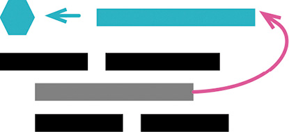
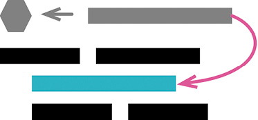
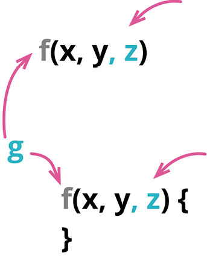
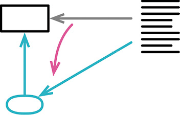
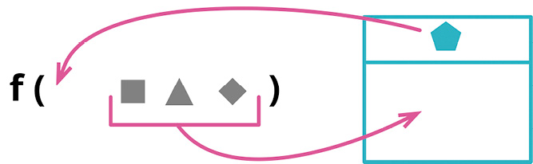
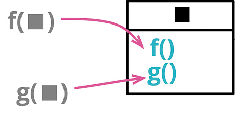
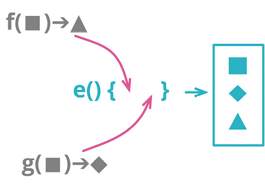
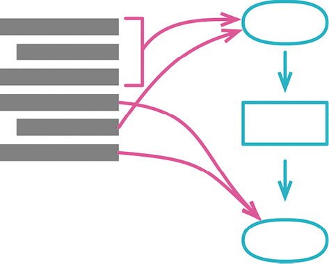

# 第 6 章 第一组重构

在重构名录的开头，我首先介绍一组我认为最有用的重构。

我最常用到的重构就是用提炼函数（106）将代码提炼到函数中，或者用提炼变量（119）来提炼变量。既然重构的作用就是应对变化，你应该不会感到惊讶，我也经常使用这两个重构的反向重构——内联函数（115）和内联变量（123）。

提炼的关键就在于命名，随着理解的加深，我经常需要改名。改变函数声明（124）可以用于修改函数的名字，也可以用于添加或删减参数。变量也可以用变量改名（137）来改名，不过需要先做封装变量（132）。在给函数的形式参数改名时，不妨先用引入参数对象（140）把常在一起出没的参数组合成一个对象。

形成函数并给函数命名，这是低层级重构的精髓。有了函数以后，就需要把它们组合成更高层级的模块。我会使用函数组合成类（144），把函数和它们操作的数据一起组合成类。另一条路径是用函数组合成变换（149）将函数组合成变换式（transform），这对于处理只读数据尤为便利。再往前一步，常常可以用拆分阶段（154）将这些模块组成界限分明的处理阶段。

## 6.1 提炼函数（Extract Function）

曾用名：提炼函数（Extract Method）

反向重构：内联函数（115）



```js
function printOwing(invoice) {
  printBanner();
  let outstanding = calculateOutstanding();

  //print details
  console.log(`name: ${invoice.customer}`);
  console.log(`amount: ${outstanding}`);
}

function printOwing(invoice) {
  printBanner();
  let outstanding = calculateOutstanding();
  printDetails(outstanding);

  function printDetails(outstanding) {
    console.log(`name: ${invoice.customer}`);
    console.log(`amount: ${outstanding}`);
  }
}
```

### 动机

提炼函数是我最常用的重构之一。（在这儿我用了“函数/function”这个词，但换成面向对象语言中的“方法/method”，或者其他任何形式的“过程/procedure”或者“子程序/subroutine”，也同样适用。）我会浏览一段代码，理解其作用，然后将其提炼到一个独立的函数中，并以这段代码的用途为这个函数命名。

对于“何时应该把代码放进独立的函数”这个问题，我曾经听过多种不同的意见。有的观点从代码的长度考虑，认为一个函数应该能在一屏中显示。有的观点从复用的角度考虑，认为只要被用过不止一次的代码，就应该单独放进一个函数；只用过一次的代码则保持内联（inline）的状态。但我认为最合理的观点是“将意图与实现分开”：如果你需要花时间浏览一段代码才能弄清它到底在干什么，那么就应该将其提炼到一个函数中，并根据它所做的事为其命名。以后再读到这段代码时，你一眼就能看到函数的用途，大多数时候根本不需要关心函数如何达成其用途（这是函数体内干的事）。

一旦接受了这个原则，我就逐渐养成一个习惯：写非常小的函数——通常只有几行的长度。在我看来，一个函数一旦超过 6 行，就开始散发臭味。我甚至经常会写一些只有 1 行代码的函数。Kent Beck 曾向我展示最初的 Smalltalk 系统中的一个例子，从那时起我就接受了“函数名的长度不重要”的观念。那时运行 Smalltalk 的计算机只有黑白屏显示器，如果你想高亮突显某些文本或图像，就需要反转视频的显示。为此，Smalltalk 用于控制图像显示的类有一个叫作 highlight 的方法，其中的实现就只是调用 reverse 方法。在这个例子里，highlight 方法的名字比实现还长，但这并不重要，因为在这个方法中，代码的意图与实现之间有着相当大的距离。

有些人担心短函数会造成大量函数调用，因而影响性能。在我尚且年轻时，有时确实会有这个问题；但如今“由于函数调用影响性能”的情况已经非常罕见了。短函数常常能让编译器的优化功能运转更良好，因为短函数可以更容易地被缓存。所以，应该始终遵循性能优化的一般指导方针，不用过早担心性能问题。

小函数得有个好名字才行，所以你必须在命名上花心思。起好名字需要练习，不过一旦你掌握了其中的技巧，就能写出很有自描述性的代码。

我经常会看见这样的情况：在一个大函数中，一段代码的顶上放着一句注释，说明这段代码要做什么。在把这段代码提炼到自己的函数中时，这样的注释往往会提示一个好名字。

### 做法

- 创造一个新函数，根据这个函数的意图来对它命名（以它“做什么”来命名，而不是以它“怎样做”命名）。

> **Tip**  
如果想要提炼的代码非常简单，例如只是一个函数调用，只要新函数的名称能够以更好的方式昭示代码意图，我还是会提炼它；但如果想不出一个更有意义的名称，这就是一个信号，可能我不应该提炼这块代码。不过，我不一定非得马上想出最好的名字，有时在提炼的过程中好的名字才会出现。有时我会提炼一个函数，尝试使用它，然后发现不太合适，再把它内联回去，这完全没问题。只要在这个过程中学到了东西，我的时间就没有白费。

如果编程语言支持嵌套函数，就把新函数嵌套在源函数里，这能减少后面需要处理的超出作用域的变量个数。我可以稍后再使用搬移函数（198）把它从源函数中搬移出去。


- 将待提炼的代码从源函数复制到新建的目标函数中。
- 仔细检查提炼出的代码，看看其中是否引用了作用域限于源函数、在提炼出的新函数中访问不到的变量。若是，以参数的形式将它们传递给新函数。

> **Tip**  
如果提炼出的新函数嵌套在源函数内部，就不存在变量作用域的问题了。

这些“作用域限于源函数”的变量通常是局部变量或者源函数的参数。最通用的做法是将它们都作为参数传递给新函数。只要没在提炼部分对这些变量赋值，处理起来就没什么难度。

如果某个变量是在提炼部分之外声明但只在提炼部分被使用，就把变量声明也搬移到提炼部分代码中去。

如果变量按值传递给提炼部分又在提炼部分被赋值，就必须多加小心。如果只有一个这样的变量，我会尝试将提炼出的新函数变成一个查询（query），用其返回值给该变量赋值。

但有时在提炼部分被赋值的局部变量太多，这时最好是先放弃提炼。这种情况下，我会考虑先使用别的重构手法，例如拆分变量（240）或者以查询取代临时变量（178），来简化变量的使用情况，然后再考虑提炼函数。


- 所有变量都处理完之后，编译。

> **Tip**  
如果编程语言支持编译期检查的话，在处理完所有变量之后做一次编译是很有用的，编译器经常会帮你找到没有被恰当处理的变量。


- 在源函数中，将被提炼代码段替换为对目标函数的调用。
- 测试。
- 查看其他代码是否有与被提炼的代码段相同或相似之处。如果有，考虑使用以函数调用取代内联代码（222）令其调用提炼出的新函数。

> **Tip**  
有些重构工具直接支持这一步。如果工具不支持，可以快速搜索一下，看看别处是否还有重复代码。


### 范例：无局部变量

在最简单的情况下，提炼函数易如反掌。请看下列函数：

```js
function printOwing(invoice) {
  let outstanding = 0;

  console.log("***********************");
  console.log("**** Customer Owes ****");
  console.log("***********************");

  // calculate outstanding
  for (const o of invoice.orders) {
    outstanding += o.amount;
  }

  // record due date
  const today = Clock.today;
  invoice.dueDate = new Date(
    today.getFullYear(),
    today.getMonth(),
    today.getDate() + 30
  );

  //print details
  console.log(`name: ${invoice.customer}`);
  console.log(`amount: ${outstanding}`);
  console.log(`due: ${invoice.dueDate.toLocaleDateString()}`);
}
```

你可能会好奇 Clock.today 是干什么的。这是一个 Clock Wrapper[mf-cw]，也就是封装系统时钟调用的对象。我尽量避免在代码中直接调用 Date.now()这样的函数，因为这会导致测试行为不可预测，以及在诊断故障时难以复制出错时的情况。

我们可以轻松提炼出“打印横幅”的代码。我只需要剪切、粘贴再插入一个函数调用动作就行了：

```js
function printOwing(invoice) {
  let outstanding = 0;

  printBanner();

  // calculate outstanding
  for (const o of invoice.orders) {
    outstanding += o.amount;
  }

  // record due date
  const today = Clock.today;
  invoice.dueDate = new Date(
    today.getFullYear(),
    today.getMonth(),
    today.getDate() + 30
  );

  //print details
  console.log(`name: ${invoice.customer}`);
  console.log(`amount: ${outstanding}`);
  console.log(`due: ${invoice.dueDate.toLocaleDateString()}`);
}
function printBanner() {
  console.log("***********************");
  console.log("**** Customer Owes ****");
  console.log("***********************");
}
```

同样，我还可以把“打印详细信息”部分也提炼出来：

```js
function printOwing(invoice) {
 let outstanding = 0;

 printBanner();

 // calculate outstanding
 for (const o of invoice.orders) {
  outstanding += o.amount;
 }

 // record due date
 const today = Clock.today;
 invoice.dueDate = new Date(today.getFullYear(), today.getMonth(), today.getDate() + 30);

 printDetails();

 function printDetails() {
  console.log(`name: ${invoice.customer}`);
  console.log(`amount: ${outstanding}`);
  console.log(`due: ${invoice.dueDate.toLocaleDateString()}`);
}
```

看起来提炼函数是一个极其简单的重构。但很多时候，情况会变得比较复杂。

在上面的例子中，我把 printDetails 函数嵌套在 printOwing 函数内部，这样前者就能访问到 printOwing 内部定义的所有变量。如果我使用的编程语言不支持嵌套函数，就没法这样操作了，那么我就要面对“提炼出一个顶层函数”的问题。此时我必须细心处理“只存在于源函数作用域”的变量，包括源函数的参数以及源函数内部定义的临时变量。

### 范例：有局部变量

局部变量最简单的情况是：被提炼代码段只是读取这些变量的值，并不修改它们。这种情况下我可以简单地将它们当作参数传给目标函数。所以，如果我面对下列函数：

```js
function printOwing(invoice) {
 let outstanding = 0;

 printBanner();

 // calculate outstanding
 for (const o of invoice.orders) {
  outstanding += o.amount;
 }

 // record due date
 const today = Clock.today;
 invoice.dueDate = new Date(today.getFullYear(), today.getMonth(), today.getDate() + 30);

 //print details
 console.log(`name: ${invoice.customer}`);
 console.log(`amount: ${outstanding}`);
 console.log(`due: ${invoice.dueDate.toLocaleDateString()}`);
```

就可以将“打印详细信息”这一部分提炼为带两个参数的函数：

```js
function printOwing(invoice) {
  let outstanding = 0;

  printBanner();

  // calculate outstanding
  for (const o of invoice.orders) {
    outstanding += o.amount;
  }

  // record due date
  const today = Clock.today;
  invoice.dueDate = new Date(
    today.getFullYear(),
    today.getMonth(),
    today.getDate() + 30
  );

  printDetails(invoice, outstanding);
}
function printDetails(invoice, outstanding) {
  console.log(`name: ${invoice.customer}`);
  console.log(`amount: ${outstanding}`);
  console.log(`due: ${invoice.dueDate.toLocaleDateString()}`);
}
```

如果局部变量是一个数据结构（例如数组、记录或者对象），而被提炼代码段又修改了这个结构中的数据，也可以如法炮制。所以，“设置到期日”的逻辑也可以用同样的方式提炼出来：

```js
function printOwing(invoice) {
  let outstanding = 0;

  printBanner();

  // calculate outstanding
  for (const o of invoice.orders) {
    outstanding += o.amount;
  }

  recordDueDate(invoice);
  printDetails(invoice, outstanding);
}
function recordDueDate(invoice) {
  const today = Clock.today;
  invoice.dueDate = new Date(
    today.getFullYear(),
    today.getMonth(),
    today.getDate() + 30
  );
}
```

### 范例：对局部变量再赋值

如果被提炼代码段对局部变量赋值，问题就变得复杂了。这里我们只讨论临时变量的问题。如果你发现源函数的参数被赋值，应该马上使用拆分变量（240）将其变成临时变量。

被赋值的临时变量也分两种情况。较简单的情况是：这个变量只在被提炼代码段中使用。若果真如此，你可以将这个临时变量的声明移到被提炼代码段中，然后一起提炼出去。如果变量的初始化和使用离得有点儿远，可以用移动语句（223）把针对这个变量的操作放到一起。

比较糟糕的情况是：被提炼代码段之外的代码也使用了这个变量。此时我需要返回修改后的值。我会用下面这个已经很眼熟的函数来展示该怎么做：

```js
function printOwing(invoice) {
  let outstanding = 0;

  printBanner();

  // calculate outstanding
  for (const o of invoice.orders) {
    outstanding += o.amount;
  }

  recordDueDate(invoice);
  printDetails(invoice, outstanding);
}
```

前面的重构我都一步到位地展示了结果，因为它们都很简单。但这次我会一步一步展示“做法”里的每个步骤。

首先，把变量声明移动到使用处之前。

```js
function printOwing(invoice) {
  printBanner();

  // calculate outstanding
  let outstanding = 0;
  for (const o of invoice.orders) {
    outstanding += o.amount;
  }

  recordDueDate(invoice);
  printDetails(invoice, outstanding);
}
```

然后把想要提炼的代码复制到目标函数中。

```js
function printOwing(invoice) {
  printBanner();

  // calculate outstanding
  let outstanding = 0;
  for (const o of invoice.orders) {
    outstanding += o.amount;
  }

  recordDueDate(invoice);
  printDetails(invoice, outstanding);
}
function calculateOutstanding(invoice) {
  let outstanding = 0;
  for (const o of invoice.orders) {
    outstanding += o.amount;
  }
  return outstanding;
}
```

由于 outstanding 变量的声明已经被搬移到提炼出的新函数中，就不需要再将其作为参数传入了。outstanding 是提炼代码段中唯一被重新赋值的变量，所以我可以直接返回它。

我的 JavaScript 环境在编译期提供不了任何价值——简直还不如文本编辑器的语法分析有用，所以“做法”里的“编译”一步可以跳过了。下一件事是修改原来的代码，令其调用新函数。新函数返回了修改后的 outstanding 变量值，我需要将其存入原来的变量中。

```js
function printOwing(invoice) {
  printBanner();
  let outstanding = calculateOutstanding(invoice);
  recordDueDate(invoice);
  printDetails(invoice, outstanding);
}
function calculateOutstanding(invoice) {
  let outstanding = 0;
  for (const o of invoice.orders) {
    outstanding += o.amount;
  }
  return outstanding;
}
```

在收工之前，我还要修改返回值的名字，使其符合我一贯的编码风格。

```js
function printOwing(invoice) {
  printBanner();
  const outstanding = calculateOutstanding(invoice);
  recordDueDate(invoice);
  printDetails(invoice, outstanding);
}
function calculateOutstanding(invoice) {
  let result = 0;
  for (const o of invoice.orders) {
    result += o.amount;
  }
  return result;
}
```

我还顺手把原来的 outstanding 变量声明成 const 的，令其在初始化之后不能再次被赋值。

这时候，你可能会问：“如果需要返回的变量不止一个，又该怎么办呢？”

有几种选择。最好的选择通常是：挑选另一块代码来提炼。我比较喜欢让每个函数都只返回一个值，所以我会安排多个函数，用以返回多个值。如果真的有必要提炼一个函数并返回多个值，可以构造并返回一个记录对象—不过通常更好的办法还是回过头来重新处理局部变量，我常用的重构手法有以查询取代临时变量（178）和拆分变量（240）。

如果我想把提炼出的函数搬移到别的上下文（例如变成顶层函数），会引发一些有趣的问题。我偏好小步前进，所以我本能的做法是先提炼成嵌套函数，然后再将其移入新的上下文。但这种做法的麻烦在于处理局部变量，而这个困难无法提前发现，直到我开始最后的搬移时才突然暴露。从这个角度考虑，即便可以先提炼成嵌套函数，或许也应该至少将目标函数放在源函数的同级，这样我就能立即看出提炼的范围是否合理。

## 6.2 内联函数（Inline Function）

曾用名：内联函数（Inline Method）

反向重构：提炼函数（106）



```js
function getRating(driver) {
 return moreThanFiveLateDeliveries(driver) ? 2 : 1;
}

function moreThanFiveLateDeliveries(driver) {
 return driver.numberOfLateDeliveries > 5;
}


function getRating(driver) {
 return (driver.numberOfLateDeliveries > 5) ? 2 : 1;
}
```

### 动机

本书经常以简短的函数表现动作意图，这样会使代码更清晰易读。但有时候你会遇到某些函数，其内部代码和函数名称同样清晰易读。也可能你重构了该函数的内部实现，使其内容和其名称变得同样清晰。若果真如此，你就应该去掉这个函数，直接使用其中的代码。间接性可能带来帮助，但非必要的间接性总是让人不舒服。

另一种需要使用内联函数的情况是：我手上有一群组织不甚合理的函数。可以将它们都内联到一个大型函数中，再以我喜欢的方式重新提炼出小函数。

如果代码中有太多间接层，使得系统中的所有函数都似乎只是对另一个函数的简单委托，造成我在这些委托动作之间晕头转向，那么我通常都会使用内联函数。当然，间接层有其价值，但不是所有间接层都有价值。通过内联手法，我可以找出那些有用的间接层，同时将无用的间接层去除。

### 做法

- 检查函数，确定它不具多态性。

> **Tip**  
如果该函数属于一个类，并且有子类继承了这个函数，那么就无法内联。


- 找出这个函数的所有调用点。
- 将这个函数的所有调用点都替换为函数本体。
- 每次替换之后，执行测试。

> **Tip**  
不必一次完成整个内联操作。如果某些调用点比较难以内联，可以等到时机成熟后再来处理。


- 删除该函数的定义。

被我这样一写，内联函数似乎很简单。但情况往往并非如此。对于递归调用、多返回点、内联至另一个对象中而该对象并无访问函数等复杂情况，我可以写上好几页。我之所以不写这些特殊情况，原因很简单：如果你遇到了这样的复杂情况，就不应该使用这个重构手法。

### 范例

在最简单的情况下，这个重构简单得不值一提。一开始的代码是这样：

```js
function rating(aDriver) {
  return moreThanFiveLateDeliveries(aDriver) ? 2 : 1;
}
function moreThanFiveLateDeliveries(aDriver) {
  return aDriver.numberOfLateDeliveries & gt;
  5;
}
```

我只要把被调用的函数的 return 语句复制出来，粘贴到调用处，取代原本的函数调用，就行了。

```js
function rating(aDriver) {
  return aDriver.numberOfLateDeliveries & amp;
  gt;
  5 ? 2 : 1;
}
```

不过实际情况可能不会这么简单，需要我多做一点儿工作，帮助代码融入它的新家。例如，开始时的代码与前面稍有不同：

```js
function rating(aDriver) {
  return moreThanFiveLateDeliveries(aDriver) ? 2 : 1;
}

function moreThanFiveLateDeliveries(dvr) {
  return dvr.numberOfLateDeliveries & gt;
  5;
}
```

几乎是一样的代码，但 moreThanFiveLateDeliveries 函数声明的形式参数名与调用处使用的变量名不同，所以我在内联时需要对代码做些微调。

```js
function rating(aDriver) {
  return aDriver.numberOfLateDeliveries & gt;
  5 ? 2 : 1;
}
```

情况还可能更复杂。例如，请看下列代码：

```js
function reportLines(aCustomer) {
  const lines = [];
  gatherCustomerData(lines, aCustomer);
  return lines;
}
function gatherCustomerData(out, aCustomer) {
  out.push(["name", aCustomer.name]);
  out.push(["location", aCustomer.location]);
}
```

我要把 gatherCustomerData 内联到 reportLines 中，这时简单的剪切和粘贴就不够了。这段代码还不算很麻烦，大多数时候我还是一步到位地完成了重构，只是需要做些调整。如果想更谨慎些，也可以每次搬移一行代码：可以首先对第一行代码使用搬移语句到调用者（217）——我还是用简单的“剪切-粘贴-调整”方式进行。

```js
function reportLines(aCustomer) {
  const lines = [];
  lines.push(["name", aCustomer.name]);
  gatherCustomerData(lines, aCustomer);
  return lines;
}
function gatherCustomerData(out, aCustomer) {
  out.push(["name", aCustomer.name]);
  out.push(["location", aCustomer.location]);
}
```

然后继续处理后面的代码行，直到完成整个重构。

```js
function reportLines(aCustomer) {
  const lines = [];
  lines.push(["name", aCustomer.name]);
  lines.push(["location", aCustomer.location]);
  return lines;
}
```

重点在于始终小步前进。大多数时候，由于我平时写的函数都很小，内联函数可以一步完成，顶多需要一点代码调整。但如果遇到了复杂的情况，我会每次内联一行代码。哪怕只是处理一行代码，也可能遇到麻烦，那么我就会使用更精细的重构手法搬移语句到调用者（217），将步子再拆细一点。有时我会自信满满地快速完成重构，然后测试却失败了，这时我会回退到上一个能通过测试的版本，带着一点儿懊恼，以更小的步伐再次重构。

## 6.3 提炼变量（Extract Variable）

曾用名：引入解释性变量（Introduce Explaining Variable）

反向重构：内联变量（123）



```js
return (
  order.quantity * order.itemPrice -
  Math.max(0, order.quantity - 500) * order.itemPrice * 0.05 +
  Math.min(order.quantity * order.itemPrice * 0.1, 100)
);

const basePrice = order.quantity * order.itemPrice;
const quantityDiscount =
  Math.max(0, order.quantity - 500) * order.itemPrice * 0.05;
const shipping = Math.min(basePrice * 0.1, 100);
return basePrice - quantityDiscount + shipping;
```

### 动机

表达式有可能非常复杂而难以阅读。这种情况下，局部变量可以帮助我们将表达式分解为比较容易管理的形式。在面对一块复杂逻辑时，局部变量使我能给其中的一部分命名，这样我就能更好地理解这部分逻辑是要干什么。

这样的变量在调试时也很方便，它们给调试器和打印语句提供了便利的抓手。

如果我考虑使用提炼变量，就意味着我要给代码中的一个表达式命名。一旦决定要这样做，我就得考虑这个名字所处的上下文。如果这个名字只在当前的函数中有意义，那么提炼变量是个不错的选择；但如果这个变量名在更宽的上下文中也有意义，我就会考虑将其暴露出来，通常以函数的形式。如果在更宽的范围可以访问到这个名字，就意味着其他代码也可以用到这个表达式，而不用把它重写一遍，这样能减少重复，并且能更好地表达我的意图。

“将新的名字暴露得更宽”的坏处则是需要额外的工作量。如果工作量很大，我会暂时搁下这个想法，稍后再用以查询取代临时变量（178）来处理它。但如果处理其他很简单，我就会立即动手，这样马上就可以使用这个新名字。有一个好的例子：如果我处理的这段代码属于一个类，对这个新的变量使用提炼函数（106）会很容易。

### 做法

- 确认要提炼的表达式没有副作用。
- 声明一个不可修改的变量，把你想要提炼的表达式复制一份，以该表达式的结果值给这个变量赋值。
- 用这个新变量取代原来的表达式。
- 测试。

如果该表达式出现了多次，请用这个新变量逐一替换，每次替换之后都要执行测试。

### 范例

我们从一个简单计算开始：

```js
function price(order) {
  //price is base price - quantity discount + shipping
  return (
    order.quantity * order.itemPrice -
    Math.max(0, order.quantity - 500) * order.itemPrice * 0.05 +
    Math.min(order.quantity * order.itemPrice * 0.1, 100)
  );
}
```

这段代码还算简单，不过我可以让它变得更容易理解。首先，我发现，底价（base price）等于数量（quantity）乘以单价（item price）。

```js
function price(order) {
  //price is base price - quantity discount + shipping
  return (
    order.quantity * order.itemPrice -
    Math.max(0, order.quantity - 500) * order.itemPrice * 0.05 +
    Math.min(order.quantity * order.itemPrice * 0.1, 100)
  );
}
```

我把这一新学到的知识放进代码里，创建一个变量，并给它起个合适的名字：

```js
function price(order) {
  //price is base price - quantity discount + shipping
  const basePrice = order.quantity * order.itemPrice;
  return (
    order.quantity * order.itemPrice -
    Math.max(0, order.quantity - 500) * order.itemPrice * 0.05 +
    Math.min(order.quantity * order.itemPrice * 0.1, 100)
  );
}
```

当然，仅仅声明并初始化一个变量没有任何作用，我还得使用它才行。所以，我用这个变量取代了原来的表达式：

```js
function price(order) {
  //price is base price - quantity discount + shipping
  const basePrice = order.quantity * order.itemPrice;
  return (
    basePrice -
    Math.max(0, order.quantity - 500) * order.itemPrice * 0.05 +
    Math.min(order.quantity * order.itemPrice * 0.1, 100)
  );
}
```

稍后的代码还用到了同样的表达式，也可以用新建的变量取代之。

```js
function price(order) {
  //price is base price - quantity discount + shipping
  const basePrice = order.quantity * order.itemPrice;
  return (
    basePrice -
    Math.max(0, order.quantity - 500) * order.itemPrice * 0.05 +
    Math.min(basePrice * 0.1, 100)
  );
}
```

下一行是计算批发折扣（quantity discount）的逻辑，我也将它提炼出来：

```js
function price(order) {
  //price is base price - quantity discount + shipping
  const basePrice = order.quantity * order.itemPrice;
  const quantityDiscount =
    Math.max(0, order.quantity - 500) * order.itemPrice * 0.05;
  return basePrice - quantityDiscount + Math.min(basePrice * 0.1, 100);
}
```

最后，我再把运费（shipping）计算提炼出来。同时我还可以删掉代码中的注释，因为现在代码已经可以完美表达自己的意义了：

```js
function price(order) {
  const basePrice = order.quantity * order.itemPrice;
  const quantityDiscount =
    Math.max(0, order.quantity - 500) * order.itemPrice * 0.05;
  const shipping = Math.min(basePrice * 0.1, 100);
  return basePrice - quantityDiscount + shipping;
}
```

### 范例：在一个类中

下面是同样的代码，但这次它位于一个类中：

```js
class Order {
  constructor(aRecord) {
    this._data = aRecord;
  }

  get quantity() {
    return this._data.quantity;
  }
  get itemPrice() {
    return this._data.itemPrice;
  }

  get price() {
    return (
      this.quantity * this.itemPrice -
      Math.max(0, this.quantity - 500) * this.itemPrice * 0.05 +
      Math.min(this.quantity * this.itemPrice * 0.1, 100)
    );
  }
}
```

我要提炼的还是同样的变量，但我意识到：这些变量名所代表的概念，适用于整个 Order 类，而不仅仅是“计算价格”的上下文。既然如此，我更愿意将它们提炼成方法，而不是变量。

```js
class Order {
  constructor(aRecord) {
    this._data = aRecord;
  }
  get quantity() {
    return this._data.quantity;
  }
  get itemPrice() {
    return this._data.itemPrice;
  }

  get price() {
    return this.basePrice - this.quantityDiscount + this.shipping;
  }
  get basePrice() {
    return this.quantity * this.itemPrice;
  }
  get quantityDiscount() {
    return Math.max(0, this.quantity - 500) * this.itemPrice * 0.05;
  }
  get shipping() {
    return Math.min(this.basePrice * 0.1, 100);
  }
}
```

这是对象带来的一大好处：它们提供了合适的上下文，方便分享相关的逻辑和数据。在如此简单的情况下，这方面的好处还不太明显；但在一个更大的类当中，如果能找出可以共用的行为，赋予它独立的概念抽象，给它起一个好名字，对于使用对象的人会很有帮助。

## 6.4 内联变量（Inline Variable）

曾用名：内联临时变量（Inline Temp）

反向重构：提炼变量（119）



```js
let basePrice = anOrder.basePrice;
return (basePrice > 1000);
```

```js
return anOrder.basePrice & gt;
1000;
```

### 动机

在一个函数内部，变量能给表达式提供有意义的名字，因此通常变量是好东西。但有时候，这个名字并不比表达式本身更具表现力。还有些时候，变量可能会妨碍重构附近的代码。若果真如此，就应该通过内联的手法消除变量。

### 做法

- 检查确认变量赋值语句的右侧表达式没有副作用。
- 如果变量没有被声明为不可修改，先将其变为不可修改，并执行测试。

> **Tip**  
这是为了确保该变量只被赋值一次。


- 找到第一处使用该变量的地方，将其替换为直接使用赋值语句的右侧表达式。
- 测试。
- 重复前面两步，逐一替换其他所有使用该变量的地方。
- 删除该变量的声明点和赋值语句。
- 测试。

## 6.5 改变函数声明（Change Function Declaration）

别名：函数改名（Rename Function）

曾用名：函数改名（Rename Method）

曾用名：添加参数（Add Parameter）

曾用名：移除参数（Remove Parameter）

别名：修改签名（Change Signature）



```js
function circum(radius) {...}
```

```js
function circumference(radius) {...}
```

### 动机

函数是我们将程序拆分成小块的主要方式。函数声明则展现了如何将这些小块组合在一起工作——可以说，它们就是软件系统的关节。和任何构造体一样，系统的好坏很大程度上取决于关节。好的关节使得给系统添加新部件很容易；而糟糕的关节则不断招致麻烦，让我们难以看清软件的行为，当需求变化时难以找到合适的地方进行修改。还好，软件是软的，我可以改变这些关节，只是要小心修改。

对于这些关节而言，最重要的元素当属函数的名字。一个好名字能让我一眼看出函数的用途，而不必查看其实现代码。但起一个好名字并不容易，我很少能第一次就把名字起对。“就算这个名字有点迷惑人，还是放着别管吧——说到底，不过就是一个名字而已。”邪恶的混乱魔王就是这样引诱我的。为了拯救程序的灵魂，绝不能上了他的当。如果我看到一个函数的名字不对，一旦发现了更好的名字，就得尽快给函数改名。这样，下一次再看到这段代码时，我就不用再费力搞懂其中到底在干什么。（有一个改进函数名字的好办法：先写一句注释描述这个函数的用途，再把这句注释变成函数的名字。）

对于函数的参数，道理也是一样。函数的参数列表阐述了函数如何与外部世界共处。函数的参数设置了一个上下文，只有在这个上下文中，我才能使用这个函数。假如有一个函数的用途是把某人的电话号码转换成特定的格式，并且该函数的参数是一个人（person），那么我就没法用这个函数来处理公司（company）的电话号码。如果我把函数接受的参数由“人”改成“电话号码”，这段处理电话号码格式的代码就能被更广泛地使用。

修改参数列表不仅能增加函数的应用范围，还能改变连接一个模块所需的条件，从而去除不必要的耦合。在前面这个例子中，修改参数列表之后，“处理电话号码格式”的逻辑所在的模块就无须了解“人”这个概念。减少模块彼此之间的信息依赖，当我要做出修改时就能减轻我大脑的负担——毕竟我的脑容量已经不如从前那么大了（跟我脑袋的大小没关系）。

如何选择正确的参数，没有简单的规则可循。我可能有一个简单的函数，用于判断支付是否逾期——如果超期 30 天未付款，那么这笔支付就逾期了。这个函数的参数应该是“支付”（payment）对象，还是支付的到期日呢？如果使用支付对象，会使这个函数与支付对象的接口耦合，但好处是可以很容易地访问后者的其他属性，当“逾期”的逻辑发生变化时就不用修改所有调用该函数的代码——换句话说，提高了该函数的封装度。

对这道难题，唯一正确的答案是“没有正确答案”，而且答案还会随着时间变化。所以我发现掌握改变函数声明重构手法至关重要，这样当我想好代码中应该有哪些关节时，才能使代码随着我的理解而演进。

在本书中引用重构手法时，我通常只使用它的主名称。但“改名”（rename）是改变函数声明的重要应用场景，所以，如果只是用于改名，我会将这个重构称作函数改名（Rename Function），这样能更清晰地表达我的用意。从做法的角度，不管是给函数改名还是修改参数列表，做法都是一样的。

### 做法

对于本书中的大部分重构，我只展示了一套做法。这并非因为只有这一套做法，而是因为大部分情况下，一套标准的做法都管用。不过，改变函数声明是一个例外。它有一套简单的做法，这套做法常常够用；但在很多时候，有必要以更渐进的方式逐步迁移到达最终结果。所以，在进行此重构时，我会查看变更的范围，自问是否能一步到位地修改函数声明及其所有调用者。如果可以，我就采用简单的做法。迁移式的做法让我可以逐步修改调用方代码，如果函数被很多地方调用，或者修改不容易，或者要修改的是一个多态函数，或者对函数声明的修改比较复杂，能渐进式地逐步修改就很重要。

### 简单的做法

如果想要移除一个参数，需要先确定函数体内没有使用该参数。

修改函数声明，使其成为你期望的状态。

找出所有使用旧的函数声明的地方，将它们改为使用新的函数声明。

测试。

最好能把大的修改拆成小的步骤，所以如果你既想修改函数名，又想添加参数，最好分成两步来做。（并且，不论何时，如果遇到了麻烦，请撤销修改，并改用迁移式做法。）

### 迁移式做法

- 如果有必要的话，先对函数体内部加以重构，使后面的提炼步骤易于开展。
- 使用提炼函数（106）将函数体提炼成一个新函数。

> **Tip**  
如果你打算沿用旧函数的名字，可以先给新函数起一个易于搜索的临时名字。


- 如果提炼出的函数需要新增参数，用前面的简单做法添加即可。
- 测试。
- 对旧函数使用内联函数（115）。
- 如果新函数使用了临时的名字，再次使用改变函数声明（124）将其改回原来的名字。
- 测试。

如果要重构的函数属于一个具有多态性的类，那么对于该函数的每个实现版本，你都需要通过“提炼出一个新函数”的方式添加一层间接，并把旧函数的调用转发给新函数。如果该函数的多态性是在一个类继承体系中体现，那么只需要在超类上转发即可；如果各个实现类之间并没有一个共同的超类，那么就需要在每个实现类上做转发。

如果要重构一个已对外发布的 API，在提炼出新函数之后，你可以暂停重构，将原来的函数声明为“不推荐使用”（deprecated），然后给客户端一点时间转为使用新函数。等你有信心所有客户端都已经从旧函数迁移到新函数，再移除旧函数的声明。

### 范例：函数改名（简单做法）

下列函数的名字太过简略了：

```js
function circum(radius) {
  return 2 * Math.PI * radius;
}
```

我想把它改得更有意义一点儿。首先修改函数的声明：

```js
function circumference(radius) {
  return 2 * Math.PI * radius;
}
```

然后找出所有调用 circum 函数的地方，将其改为 circumference。

在不同的编程语言环境中，“找到所有调用旧函数的地方”这件事的难度也各异。静态类型加上趁手的 IDE 能提供最好的体验，通常可以全自动地完成函数改名，出错的概率极低。如果没有静态类型，就需要多花些工夫：即便再好的搜索工具，也可能会找出很多同名但并非同一函数的地方。

增减参数的做法也相同：找出所有调用者，修改函数声明，然后修改调用者。最好是能分步骤修改：如果既想给函数改名，又想添加参数，我会先完成改名，测试，然后添加参数，然后再次测试。

这个重构的简单做法缺点在于，我必须一次性修改所有调用者和函数声明（或者说，所有的函数声明，如果有多态的话）。如果只有不多的几处调用者，或者如果有可靠的自动化重构工具，这样做是没问题的。但如果调用者很多，事情就会变得很棘手。另外，如果函数的名字并不唯一，也可能造成问题。例如，我想给代表“人”的 Person 类的 changeAddress 函数改名，但同时在代表“保险合同”的 InsuranceAgreement 类中也有一个同名的函数，而我并不想修改后者的名字。修改越是复杂，我就越不希望一步到位地完成。如果有这些问题出现，我就会改为使用迁移式做法。同样，如果使用简单做法时出了什么错，我也会把代码回滚到上一个已知正确的状态，并改用迁移式做法再来一遍。

### 范例：函数改名（迁移式做法）

还是这个名字太过简略的函数：

```js
function circum(radius) {
  return 2 * Math.PI * radius;
}
```

按照迁移式做法，我首先要对整个函数体使用提炼函数（106）：

```js
function circum(radius) {
  return circumference(radius);
}
function circumference(radius) {
  return 2 * Math.PI * radius;
}
```

此时我要执行测试，然后对旧函数使用内联函数（115）：找出所有调用旧函数的地方，将其改为调用新函数。每次修改之后都可以执行测试，这样我就可以小步前进，每次修改一处调用者。所有调用者都修改完之后，我就可以删除旧函数。

大多数重构手法只用于修改我有权修改的代码，但这个重构手法同样适用于已发布 API——使用这些 API 的代码我无权修改。以上面的代码为例，创建出 circumference 函数之后，我就可以暂停重构，并（如果可以的话）将 circum 函数标记为 deprecated。然后我就耐心等待客户端改用 circumference 函数，等他们都改完了，我再删除 circum 函数。即便永远也抵达不了“删除 circum 函数”这个快乐的终点，至少新代码有了一个更好的名字。

### 范例：添加参数

想象一个管理图书馆的软件，其中有代表“图书”的 Book 类，它可以接受顾客（customer）的预订（reservation）：

#### class Book...

```js
  addReservation(customer) {
  this._reservations.push(customer);
}
```

现在我需要支持“高优先级预订”，因此我要给 addReservation 额外添加一个参数，用于标记这次预订应该进入普通队列还是优先队列。如果能很容易地找到并修改所有调用方，我可以直接修改；但如果不行，我仍然可以采用迁移式做法，下面是详细的过程。

首先，我用提炼函数（106）把 addReservation 的函数体提炼出来，放进一个新函数。这个新函数最终会叫 addReservation，但新旧两个函数不能同时占用这个名字，所以我会先给新函数起一个容易搜索的临时名字。

#### class Book...

```js
addReservation(customer) {
  this.zz_addReservation(customer);
}
zz_addReservation(customer) {
  this._reservations.push(customer);
}
```

然后我会在新函数的声明中增加参数，同时修改旧函数中调用新函数的地方（也就是采用简单做法完成这一步）。

#### class Book...

```js
addReservation(customer) {
  this.zz_addReservation(customer, false);
}

zz_addReservation(customer, isPriority) {
  this._reservations.push(customer);
}
```

在修改调用方之前，我喜欢利用 JavaScript 的语言特性先应用引入断言（302），确保调用方一定会用到这个新参数。

#### class Book...

```js
zz_addReservation(customer, isPriority) {
  assert(isPriority === true || isPriority === false);
  this._reservations.push(customer);
}
```

现在，如果我在修改调用方时出了错，没有提供新参数，这个断言会帮我抓到错误——以我过去的经验来看，比我更容易出错的程序员怕是不多。

现在，我可以对源函数使用内联函数（115），使其调用者转而使用新函数。这样我可以每次只修改一个调用者。

现在我就可以把新函数改回原来的名字了。一般而言，此时用简单做法就够了；但如果有必要，也可以再用一遍迁移式做法。

### 范例：把参数改为属性

此前的范例都很简单：改个名，增加一个参数。有了迁移式做法以后，这个重构手法可以相当利落地处理更复杂的情况。下面就是一个更复杂的例子。

假设我有一个函数，用于判断顾客（customer）是不是来自新英格兰（New England）地区：

```js
function inNewEngland(aCustomer) {
  return ["MA", "CT", "ME", "VT", "NH", "RI"].includes(aCustomer.address.state);
}
```

下面是一个调用该函数的地方：

#### 调用方...

```js
  const newEnglanders = someCustomers.filter(c => inNewEngland(c));
```

inNewEngland 函数只用到了顾客所在的州（state）这项信息，基于这个信息来判断顾客是否来自新英格兰地区。我希望重构这个函数，使其接受州代码（state code）作为参数，这样就能去掉对“顾客”概念的依赖，使这个函数能在更多的上下文中使用。

在使用改变函数声明时，我通常会先运用提炼函数（106），但在这里我会先对函数体做一点重构，使后面的重构步骤更简单。我先用提炼变量（119）提炼出我想要的新参数：

```js
function inNewEngland(aCustomer) {
  const stateCode = aCustomer.address.state;
  return ["MA", "CT", "ME", "VT", "NH", "RI"].includes(stateCode);
}
```

然后再用提炼函数（106）创建新函数：

```js
function inNewEngland(aCustomer) {
  const stateCode = aCustomer.address.state;
  return xxNEWinNewEngland(stateCode);
}

function xxNEWinNewEngland(stateCode) {
  return ["MA", "CT", "ME", "VT", "NH", "RI"].includes(stateCode);
}
```

我会给新函数起一个好记又独特的临时名字，这样回头要改回原来的名字时也会简单一些。（你也看到，对于怎么起这些临时名字，我并没有统一的标准。）

我会在源函数中使用内联变量（123），把刚才提炼出来的参数内联回去：

```js
function inNewEngland(aCustomer) {
  return xxNEWinNewEngland(aCustomer.address.state);
}
```

然后我会用内联函数（115）把旧函数内联到调用处，其效果就是把旧函数的调用处改为调用新函数。我可以每次修改一个调用处。

#### 调用方...

```js
  const newEnglanders = someCustomers.filter(c => xxNEWinNewEngland(c.address.state));
```

旧函数被内联到各调用处之后，我就再次使用改变函数声明，把新函数改回旧名字：

#### 调用方...

```js
  const newEnglanders = someCustomers.filter(c => inNewEngland(c.address.state));
```

#### 顶层作用域...

```js
function inNewEngland(stateCode) {
  return ["MA", "CT", "ME", "VT", "NH", "RI"].includes(stateCode);
}
```

自动化重构工具减少了迁移式做法的用武之地，同时也使迁移式做法更加高效。自动化重构工具可以安全地处理相当复杂的改名、参数变更等情况，所以迁移式做法的用武之地就变少了，因为自动化重构工具经常能提供足够的支持。如果遇到类似这里的例子，尽管工具无法自动完成整个重构，还是可以更快、更安全地完成关键的提炼和内联步骤，从而简化整个重构过程。

## 6.6 封装变量（Encapsulate Variable）

曾用名：自封装字段（Self-Encapsulate Field）

曾用名：封装字段（Encapsulate Field）



```js
let defaultOwner = { firstName: "Martin", lastName: "Fowler" };
```

```js
let defaultOwnerData = { firstName: "Martin", lastName: "Fowler" };
export function defaultOwner() {
  return defaultOwnerData;
}
export function setDefaultOwner(arg) {
  defaultOwnerData = arg;
}
```

### 动机

重构的作用就是调整程序中的元素。函数相对容易调整一些，因为函数只有一种用法，就是调用。在改名或搬移函数的过程中，总是可以比较容易地保留旧函数作为转发函数（即旧代码调用旧函数，旧函数再调用新函数）。这样的转发函数通常不会存在太久，但的确能够简化重构过程。

数据就要麻烦得多，因为没办法设计这样的转发机制。如果我把数据搬走，就必须同时修改所有引用该数据的代码，否则程序就不能运行。如果数据的可访问范围很小，比如一个小函数内部的临时变量，那还不成问题。但如果可访问范围变大，重构的难度就会随之增大，这也是说全局数据是大麻烦的原因。

所以，如果想要搬移一处被广泛使用的数据，最好的办法往往是先以函数形式封装所有对该数据的访问。这样，我就能把“重新组织数据”的困难任务转化为“重新组织函数”这个相对简单的任务。

封装数据的价值还不止于此。封装能提供一个清晰的观测点，可以由此监控数据的变化和使用情况；我还可以轻松地添加数据被修改时的验证或后续逻辑。我的习惯是：对于所有可变的数据，只要它的作用域超出单个函数，我就会将其封装起来，只允许通过函数访问。数据的作用域越大，封装就越重要。处理遗留代码时，一旦需要修改或增加使用可变数据的代码，我就会借机把这份数据封装起来，从而避免继续加重耦合一份已经广泛使用的数据。

面向对象方法如此强调对象的数据应该保持私有（private），背后也是同样的原理。每当看见一个公开（public）的字段时，我就会考虑使用封装变量（在这种情况下，这个重构手法常被称为封装字段）来缩小其可见范围。一些更激进的观点认为，即便在类内部，也应该通过访问函数来使用字段——这种做法也称为“自封装”。大体而言，我认为自封装有点儿过度了——如果一个类大到需要将字段自封装起来的程度，那么首先应该考虑把这个类拆小。不过，在分拆类之前，自封装字段倒是一个有用的步骤。

封装数据很重要，不过，不可变数据更重要。如果数据不能修改，就根本不需要数据更新前的验证或者其他逻辑钩子。我可以放心地复制数据，而不用搬移原来的数据——这样就不用修改使用旧数据的代码，也不用担心有些代码获得过时失效的数据。不可变性是强大的代码防腐剂。

### 做法

- 创建封装函数，在其中访问和更新变量值。
- 执行静态检查。
- 逐一修改使用该变量的代码，将其改为调用合适的封装函数。每次替换之后，执行测试。
- 限制变量的可见性。

> **Tip**  
有时没办法阻止直接访问变量。若果真如此，可以试试将变量改名，再执行测试，找出仍在直接使用该变量的代码。


- 测试。
- 如果变量的值是一个记录，考虑使用封装记录（162）。

### 范例

下面这个全局变量中保存了一些有用的数据：

```js
let defaultOwner = { firstName: "Martin", lastName: "Fowler" };
```

使用它的代码平淡无奇：

```js
spaceship.owner = defaultOwner;
```

更新这段数据的代码是这样：

```js
defaultOwner = { firstName: "Rebecca", lastName: "Parsons" };
```

首先我要定义读取和写入这段数据的函数，给它做个基础的封装。

```js
function getDefaultOwner() {
  return defaultOwner;
}
function setDefaultOwner(arg) {
  defaultOwner = arg;
}
```

然后就开始处理使用 defaultOwner 的代码。每看见一处引用该数据的代码，就将其改为调用取值函数。

```js
spaceship.owner = getDefaultOwner();
```

每看见一处给变量赋值的代码，就将其改为调用设值函数。

```js
setDefaultOwner({ firstName: "Rebecca", lastName: "Parsons" });
```

每次替换之后，执行测试。

处理完所有使用该变量的代码之后，我就可以限制它的可见性。这一步的用意有两个，一来是检查是否遗漏了变量的引用，二来可以保证以后的代码也不会直接访问该变量。在 JavaScript 中，我可以把变量和访问函数搬移到单独一个文件中，并且只导出访问函数，这样就限制了变量的可见性。

#### defaultOwner.js...

```js
let defaultOwner = { firstName: "Martin", lastName: "Fowler" };
export function getDefaultOwner() {
  return defaultOwner;
}
export function setDefaultOwner(arg) {
  defaultOwner = arg;
}
```

如果条件不允许限制对变量的访问，可以将变量改名，然后再次执行测试，检查是否仍有代码在直接使用该变量。这阻止不了未来的代码直接访问变量，不过可以给变量起个有意义又难看的名字（例如`__privateOnly_defaultOwner`），提醒后来的客户端。

我不喜欢给取值函数加上 get 前缀，所以我对这个函数改名。

#### defaultOwner.js...

```js
let defaultOwnerData = { firstName: "Martin", lastName: "Fowler" };
export function getdefaultOwner() {
  return defaultOwnerData;
}
export function setDefaultOwner(arg) {
  defaultOwnerData = arg;
}
```

JavaScript 有一种惯例：给取值函数和设值函数起同样的名字，根据有没有传入参数来区分。我把这种做法称为“重载取值/设值函数”（Overloaded Getter Setter）[mf-orgs]，并且我强烈反对这种做法。所以，虽然我不喜欢 get 前缀，但我会保留 set 前缀。

### 封装值

前面介绍的基本重构手法对数据结构的引用做了封装，使我能控制对该数据结构的访问和重新赋值，但并不能控制对结构内部数据项的修改：

```js
const owner1 = defaultOwner();
assert.equal("Fowler", owner1.lastName, "when set");
const owner2 = defaultOwner();
owner2.lastName = "Parsons";
assert.equal("Parsons", owner1.lastName, "after change owner2"); // is this ok?
```

前面的基本重构手法只封装了对最外层数据的引用。很多时候这已经足够了。但也有很多时候，我需要把封装做得更深入，不仅控制对变量引用的修改，还要控制对变量内容的修改。

这有两个办法可以做到。最简单的办法是禁止对数据结构内部的数值做任何修改。我最喜欢的一种做法是修改取值函数，使其返回该数据的一份副本。

#### defaultOwner.js...

```js
let defaultOwnerData = { firstName: "Martin", lastName: "Fowler" };
export function defaultOwner() {
  return Object.assign({}, defaultOwnerData);
}
export function setDefaultOwner(arg) {
  defaultOwnerData = arg;
}
```

对于列表数据，我尤其常用这一招。如果我在取值函数中返回数据的一份副本，客户端可以随便修改它，但不会影响到共享的这份数据。但在使用副本的做法时，我必须格外小心：有些代码可能希望能修改共享的数据。若果真如此，我就只能依赖测试来发现问题了。另一种做法是阻止对数据的修改，比如通过封装记录（162）就能很好地实现这一效果。

```js
  let defaultOwnerData = {firstName: "Martin", lastName: "Fowler"};
export function defaultOwner()       {return new Person(defaultOwnerData);}
export function setDefaultOwner(arg) {defaultOwnerData = arg;}

class Person {
 constructor(data) {
  this._lastName = data.lastName;
  this._firstName = data.firstName
 }
 get lastName() {return this._lastName;}
 get firstName() {return this._firstName;}
 // and so on for other properties
```

现在，如果客户端调用 defaultOwner 函数获得“默认拥有人”数据、再尝试对其属性（即 lastName 和 firstName）重新赋值，赋值不会产生任何效果。对于侦测或阻止修改数据结构内部的数据项，各种编程语言有不同的方式，所以我会根据当下使用的语言来选择具体的办法。

“侦测和阻止修改数据结构内部的数据项”通常只是个临时处置。随后我可以去除这些修改逻辑，或者提供适当的修改函数。这些都处理完之后，我就可以修改取值函数，使其返回一份数据副本。

到目前为止，我都在讨论“在取数据时返回一份副本”，其实设值函数也可以返回一份副本。这取决于数据从哪儿来，以及我是否需要保留对源数据的连接，以便知悉源数据的变化。如果不需要这样一条连接，那么设值函数返回一份副本就有好处：可以防止因为源数据发生变化而造成的意外事故。很多时候可能没必要复制一份数据，不过多一次复制对性能的影响通常也都可以忽略不计。但是，如果不做复制，风险则是未来可能会陷入漫长而困难的调试排错过程。

请记住，前面提到的数据复制、类封装等措施，都只在数据记录结构中深入了一层。如果想走得更深入，就需要更多层级的复制或是封装。

如你所见，数据封装很有价值，但往往并不简单。到底应该封装什么，以及如何封装，取决于数据被使用的方式，以及我想要修改数据的方式。不过，一言以蔽之，数据被使用得越广，就越是值得花精力给它一个体面的封装。

## 6.7 变量改名（Rename Variable）


```js
let a = height * width;
```

```js
let area = height * width;
```

### 动机

好的命名是整洁编程的核心。变量可以很好地解释一段程序在干什么——如果变量名起得好的话。但我经常会把名字起错——有时是因为想得不够仔细，有时是因为我对问题的理解加深了，还有时是因为程序的用途随着用户的需求改变了。

使用范围越广，名字的好坏就越重要。只在一行的 lambda 表达式中使用的变量，跟踪起来很容易——像这样的变量，我经常只用一个字母命名，因为变量的用途在这个上下文中很清晰。同理，短函数的参数名也常常很简单。不过在 JavaScript 这样的动态类型语言中，我喜欢把类型信息也放进名字里（于是变量名可能叫 aCustomer）。

对于作用域超出一次函数调用的字段，则需要更用心命名。这是我最花心思的地方。

### 机制

- 如果变量被广泛使用，考虑运用封装变量（132）将其封装起来。
- 找出所有使用该变量的代码，逐一修改。

> **Tip**  
如果在另一个代码库中使用了该变量，这就是一个“已发布变量”（published variable），此时不能进行这个重构。

如果变量值从不修改，可以将其复制到一个新名字之下，然后逐一修改使用代码，每次修改后执行测试。


- 测试。

### 范例

如果要改名的变量只作用于一个函数（临时变量或者参数），对其改名是最简单的。这种情况太简单，根本不需要范例：找到变量的所有引用，修改过来就行。完成修改之后，我会执行测试，确保没有破坏什么东西。

如果变量的作用域不止于单个函数，问题就会出现。代码库的各处可能有很多地方使用它：

```js
let tpHd = "untitled";
```

有些地方是在读取变量值：

```js
result += `<h1>${tpHd}</h1>`;
```

另一些地方则更新它的值：

```js
tpHd = obj["articleTitle"];
```

对于这种情况，我通常的反应是运用封装变量（132）：

```js
result += `<h1>${title()}</h1>`;

setTitle(obj["articleTitle"]);

function title() {
  return tpHd;
}
function setTitle(arg) {
  tpHd = arg;
}
```

现在就可以给变量改名：

```js
let _title = "untitled";

function title() {
  return _title;
}
function setTitle(arg) {
  _title = arg;
}
```

我可以继续重构下去，将包装函数内联回去，这样所有的调用者就变回直接使用变量的状态。不过我很少这样做。如果这个变量被广泛使用，以至于我感到需要先做封装才敢改名，那就有必要保持这个状态，将变量封装在函数后面。

> **Tip**  
如果我确实想内联，在重构过程中，我就会将取值函数命名为 getTitle，并且其中的变量名也不会以下划线开头。


### 给常量改名

如果我想改名的是一个常量（或者在客户端看来就像是常量的元素），我可以复制这个常量，这样既不需要封装，又可以逐步完成改名。假如原来的变量声明是这样：

```js
const cpyNm = "Acme Gooseberries";
```

改名的第一步是复制这个常量：

```js
const companyName = "Acme Gooseberries";
const cpyNm = companyName;
```

有了这个副本，我就可以逐一修改引用旧常量的代码，使其引用新的常量。全部修改完成后，我会删掉旧的常量。我喜欢先声明新的常量名，然后把新常量复制给旧的名字。这样最后删除旧名字时会稍微容易一点，如果测试失败，再把旧常量放回来也稍微容易一点。

这个做法不仅适用于常量，也同样适用于客户端只能读取的变量（例如 JavaScript 模块中导出的变量）。

## 6.8 引入参数对象（Introduce Parameter Object）



```js
function amountInvoiced(startDate, endDate) {...}
function amountReceived(startDate, endDate) {...}
function amountOverdue(startDate, endDate) {...}
```

```js
function amountInvoiced(aDateRange) {...}
function amountReceived(aDateRange) {...}
function amountOverdue(aDateRange) {...}
```

### 动机

我常会看见，一组数据项总是结伴同行，出没于一个又一个函数。这样一组数据就是所谓的数据泥团，我喜欢代之以一个数据结构。

将数据组织成结构是一件有价值的事，因为这让数据项之间的关系变得明晰。使用新的数据结构，参数的参数列表也能缩短。并且经过重构之后，所有使用该数据结构的函数都会通过同样的名字来访问其中的元素，从而提升代码的一致性。

但这项重构真正的意义在于，它会催生代码中更深层次的改变。一旦识别出新的数据结构，我就可以重组程序的行为来使用这些结构。我会创建出函数来捕捉围绕这些数据的共用行为——可能只是一组共用的函数，也可能用一个类把数据结构与使用数据的函数组合起来。这个过程会改变代码的概念图景，将这些数据结构提升为新的抽象概念，可以帮助我更好地理解问题域。果真如此，这个重构过程会产生惊人强大的效用——但如果不用引入参数对象开启这个过程，后面的一切都不会发生。

### 做法

- 如果暂时还没有一个合适的数据结构，就创建一个。

> **Tip**  
我倾向于使用类，因为稍后把行为放进来会比较容易。我通常会尽量确保这些新建的数据结构是值对象[mf-vo]。


- 测试。
- 使用改变函数声明（124）给原来的函数新增一个参数，类型是新建的数据结构。
- 测试。
- 调整所有调用者，传入新数据结构的适当实例。每修改一处，执行测试。
- 用新数据结构中的每项元素，逐一取代参数列表中与之对应的参数项，然后删除原来的参数。测试。

### 范例

下面要展示的代码会查看一组温度读数（reading），检查是否有任何一条读数超出了指定的运作温度范围（range）。温度读数的数据如下：

```js
const station = {
  name: "ZB1",
  readings: [
    { temp: 47, time: "2016-11-10 09:10" },
    { temp: 53, time: "2016-11-10 09:20" },
    { temp: 58, time: "2016-11-10 09:30" },
    { temp: 53, time: "2016-11-10 09:40" },
    { temp: 51, time: "2016-11-10 09:50" },
  ],
};
```

下面的函数负责找到超出指定范围的温度读数：

```js
function readingsOutsideRange(station, min, max) {
 return station.readings
  .filter(r => r.temp < min || r.temp > max);
}
```

调用该函数的代码可能是下面这样的。

调用方

```js
alerts = readingsOutsideRange(
  station,
  operatingPlan.temperatureFloor,
  operatingPlan.temperatureCeiling
);
```

请注意，这里的调用代码从另一个对象中抽出两项数据，转手又把这一对数据传递给 readingsOutsideRange。代表“运作计划”的 operatingPlan 对象用了另外的名字来表示温度范围的下限和上限，与 readingsOutsideRange 中所用的名字不同。像这样用两项各不相干的数据来表示一个范围的情况并不少见，最好是将其组合成一个对象。我会首先为要组合的数据声明一个类：

```js
class NumberRange {
  constructor(min, max) {
    this._data = { min: min, max: max };
  }
  get min() {
    return this._data.min;
  }
  get max() {
    return this._data.max;
  }
}
```

我声明了一个类，而不是基本的 JavaScript 对象，因为这个重构通常只是一系列重构的起点，随后我会把行为搬移到新建的对象中。既然类更适合承载数据与行为的组合，我就直接从声明一个类开始。同时，在这个新类中，我不会提供任何更新数据的函数，因为我有可能将其处理成值对象（Value Object）[mf-vo]。在使用这个重构手法时，大多数情况下我都会创建值对象。

然后我会运用改变函数声明（124），把新的对象作为参数传给 readingsOutsideRange。

```js
function readingsOutsideRange(station, min, max, range) {
 return station.readings
  .filter(r => r.temp < min || r.temp > max);
}
```

在 JavaScript 中，此时我不需要修改调用方代码，但在其他语言中，我必须在调用处为新参数传入 null 值，就像下面这样。

调用方

```js
alerts = readingsOutsideRange(
  station,
  operatingPlan.temperatureFloor,
  operatingPlan.temperatureCeiling,
  null
);
```

到目前为止，我还没有修改任何行为，所以测试应该仍然能通过。随后，我会挨个找到函数的调用处，传入合适的温度范围。

调用方

```js
const range = new NumberRange(
  operatingPlan.temperatureFloor,
  operatingPlan.temperatureCeiling
);
alerts = readingsOutsideRange(
  station,
  operatingPlan.temperatureFloor,
  operatingPlan.temperatureCeiling,
  range
);
```

此时我还是没有修改任何行为，因为新添的参数没有被使用。所有测试应该仍然能通过。

现在我可以开始修改使用参数的代码了。先从“最大值”开始：

```js
function readingsOutsideRange(station, min, max, range) {
 return station.readings
  .filter(r => r.temp < min || r.temp > range.max);
}
```

调用方

```js
const range = new NumberRange(
  operatingPlan.temperatureFloor,
  operatingPlan.temperatureCeiling
);
alerts = readingsOutsideRange(
  station,
  operatingPlan.temperatureFloor,
  operatingPlan.temperatureCeiling,
  range
);
```

此时要执行测试。如果测试通过，我再接着处理另一个参数。

```js
function readingsOutsideRange(station, min, range) {
 return station.readings
  .filter(r => r.temp < range.min || r.temp > range.max);
}
```

调用方

```js
const range = new NumberRange(
  operatingPlan.temperatureFloor,
  operatingPlan.temperatureCeiling
);
alerts = readingsOutsideRange(station, operatingPlan.temperatureFloor, range);
```

这项重构手法到这儿就完成了。不过，将一堆参数替换成一个真正的对象，这只是长征第一步。创建一个类是为了把行为搬移进去。在这里，我可以给“范围”类添加一个函数，用于测试一个值是否落在范围之内。

```js
function readingsOutsideRange(station, range) {
 return station.readings
  .f ilter(r => !range.contains(r.temp));
}
```

#### class NumberRange...

```js
  contains(arg) {return (arg >= this.min &amp;&amp; arg <= this.max);}
```

这样我就迈出了第一步，开始逐渐打造一个真正有用的“范围”[mf-range]类。一旦识别出“范围”这个概念，那么每当我在代码中发现“最大/最小值”这样一对数字时，我就会考虑是否可以将其改为使用“范围”类。（例如，我马上就会考虑把“运作计划”类中的 temperatureFloor 和 temperatureCeiling 替换为 temperatureRange。）在观察这些成对出现的数字如何被使用时，我会发现一些有用的行为，并将其搬移到“范围”类中，简化其使用方法。比如，我可能会先给这个类加上“基于数值判断相等性”的函数，使其成为一个真正的值对象。

## 6.9 函数组合成类（Combine Functions into Class）



```js
function base(aReading) {...}
function taxableCharge(aReading) {...}
function calculateBaseCharge(aReading) {...}
```

```js
class Reading {
  base() {...}
  taxableCharge() {...}
  calculateBaseCharge() {...}
}
```

### 动机

类，在大多数现代编程语言中都是基本的构造。它们把数据与函数捆绑到同一个环境中，将一部分数据与函数暴露给其他程序元素以便协作。它们是面向对象语言的首要构造，在其他程序设计方法中也同样有用。

如果发现一组函数形影不离地操作同一块数据（通常是将这块数据作为参数传递给函数），我就认为，是时候组建一个类了。类能明确地给这些函数提供一个共用的环境，在对象内部调用这些函数可以少传许多参数，从而简化函数调用，并且这样一个对象也可以更方便地传递给系统的其他部分。

除了可以把已有的函数组织起来，这个重构还给我们一个机会，去发现其他的计算逻辑，将它们也重构到新的类当中。

将函数组织到一起的另一种方式是函数组合成变换（149）。具体使用哪个重构手法，要看程序整体的上下文。使用类有一大好处：客户端可以修改对象的核心数据，通过计算得出的派生数据则会自动与核心数据保持一致。

类似这样的一组函数不仅可以组合成一个类，而且可以组合成一个嵌套函数。通常我更倾向于类而非嵌套函数，因为后者测试起来会比较困难。如果我想对外暴露多个函数，也必须采用类的形式。

在有些编程语言中，类不是一等公民，而函数则是。面对这样的语言，可以用“函数作为对象”（Function As Object）[mf-fao]的形式来实现这个重构手法。

### 做法

- 运用封装记录（162）对多个函数共用的数据记录加以封装。

> **Tip**  
如果多个函数共用的数据还未组织成记录结构，则先运用引入参数对象（140）将其组织成记录。


- 对于使用该记录结构的每个函数，运用搬移函数（198）将其移入新类。

> **Tip**  
如果函数调用时传入的参数已经是新类的成员，则从参数列表中去除之。


- 用以处理该数据记录的逻辑可以用提炼函数（106）提炼出来，并移入新类。

### 范例

我在英格兰长大，那是一个热爱喝茶的国度。（个人而言，我不喜欢在英格兰喝到的大部分茶，对中国茶和日本茶倒是情有独钟。）所以，我虚构了一种用于向老百姓供给茶水的公共设施。每个月会有软件读取茶水计量器的数据，得到类似这样的读数（reading）：

```js
reading = { customer: "ivan", quantity: 10, month: 5, year: 2017 };
```

浏览处理这些数据记录的代码，我发现有很多地方在做着相似的计算，于是我找到了一处计算“基础费用”（base charge）的逻辑。

#### 客户端 1...

```js
const aReading = acquireReading();
const baseCharge = baseRate(aReading.month, aReading.year) * aReading.quantity;
```

在英格兰，一切生活必需品都得交税，茶自然也不例外。不过，按照规定，只要不超出某个必要用量，就不用交税。

#### 客户端 2...

```js
const aReading = acquireReading();
const base = baseRate(aReading.month, aReading.year) * aReading.quantity;
const taxableCharge = Math.max(0, base - taxThreshold(aReading.year));
```

我相信你也发现了：计算基础费用的公式被重复了两遍。如果你跟我有一样的习惯，现在大概已经在着手提炼函数（106）了。有趣的是，好像别人已经动过这个脑筋了。

#### 客户端 3...

```js
const aReading = acquireReading();
const basicChargeAmount = calculateBaseCharge(aReading);

function calculateBaseCharge(aReading) {
  return baseRate(aReading.month, aReading.year) * aReading.quantity;
}
```

看到这里，我有一种自然的冲动，想把前面两处客户端代码都改为使用这个函数。但这样一个顶层函数的问题在于，它通常位于一个文件中，读者不一定能想到来这里寻找它。我更愿意对代码多做些修改，让该函数与其处理的数据在空间上有更紧密的联系。为此目的，不妨把数据本身变成一个类。

我可以运用封装记录（162）将记录变成类。

```js
class Reading {
  constructor(data) {
    this._customer = data.customer;
    this._quantity = data.quantity;
    this._month = data.month;
    this._year = data.year;
  }
  get customer() {
    return this._customer;
  }
  get quantity() {
    return this._quantity;
  }
  get month() {
    return this._month;
  }
  get year() {
    return this._year;
  }
}
```

首先，我想把手上已有的函数 calculateBaseCharge 搬到新建的 Reading 类中。一得到原始的读数数据，我就用 Reading 类将它包装起来，然后就可以在函数中使用 Reading 类了。

#### 客户端 3...

```js
const rawReading = acquireReading();
const aReading = new Reading(rawReading);
const basicChargeAmount = calculateBaseCharge(aReading);
```

然后我用搬移函数（198）把 calculateBaseCharge 搬到新类中。

#### class Reading...

```js
  get calculateBaseCharge() {
  return baseRate(this.month, this.year) * this.quantity;
}
```

#### 客户端 3...

```js
const rawReading = acquireReading();
const aReading = new Reading(rawReading);
const basicChargeAmount = aReading.calculateBaseCharge;
```

搬移的同时，我会顺便运用函数改名（124），按照我喜欢的风格对这个函数改名。

```js
  get baseCharge() {
  return baseRate(this.month, this.year) * this.quantity;
}
```

#### 客户端 3...

```js
const rawReading = acquireReading();
const aReading = new Reading(rawReading);
const basicChargeAmount = aReading.baseCharge;
```

用这个名字，Reading 类的客户端将不知道 baseCharge 究竟是一个字段还是推演计算出的值。这是好事，它符合“统一访问原则”（Uniform Access Principle）[mf-ua]。

现在我可以修改客户端 1 的代码，令其调用新的方法，不要重复计算基础费用。

#### 客户端 1...

```js
const rawReading = acquireReading();
const aReading = new Reading(rawReading);
const baseCharge = aReading.baseCharge;
```

很有可能我会顺手用内联变量（123）把 baseCharge 变量给去掉。不过，我们当下介绍的重构手法更关心“计算应税费用”的逻辑。同样，我先将那里的客户端代码改为使用新建的 baseCharge 属性。

#### 客户端 2...

```js
const rawReading = acquireReading();
const aReading = new Reading(rawReading);
const taxableCharge = Math.max(
  0,
  aReading.baseCharge - taxThreshold(aReading.year)
);
```

运用提炼函数（106）将计算应税费用（taxable charge）的逻辑提炼成函数：

```js
function taxableChargeFn(aReading) {
  return Math.max(0, aReading.baseCharge - taxThreshold(aReading.year));
}
```

#### 客户端 3...

```js
const rawReading = acquireReading();
const aReading = new Reading(rawReading);
const taxableCharge = taxableChargeFn(aReading);
```

然后我运用搬移函数（198）将其移入 Reading 类：

#### class Reading...

```js
get taxableCharge() {
  return Math.max(0, this.baseCharge - taxThreshold(this.year));
}
```

#### 客户端 3...

```js
const rawReading = acquireReading();
const aReading = new Reading(rawReading);
const taxableCharge = aReading.taxableCharge;
```

由于所有派生数据都是在使用时计算得出的，所以对存储下来的读数进行修改也没问题。一般而论，我更倾向于使用不可变的数据；但很多时候我们必须得使用可变数据（比如 JavaScript 整个语言生态在设计时就没有考虑数据的不可变性）。如果数据确有可能被更新，那么用类将其封装起来会很有帮助。

## 6.10 函数组合成变换（Combine Functions into Transform）



```js
function base(aReading) {...}
function taxableCharge(aReading) {...}
```

```js
function enrichReading(argReading) {
  const aReading = _.cloneDeep(argReading);
  aReading.baseCharge = base(aReading);
  aReading.taxableCharge = taxableCharge(aReading);
  return aReading;
}
```

### 动机

在软件中，经常需要把数据“喂”给一个程序，让它再计算出各种派生信息。这些派生数值可能会在几个不同地方用到，因此这些计算逻辑也常会在用到派生数据的地方重复。我更愿意把所有计算派生数据的逻辑收拢到一处，这样始终可以在固定的地方找到和更新这些逻辑，避免到处重复。

一个方式是采用数据变换（transform）函数：这种函数接受源数据作为输入，计算出所有的派生数据，将派生数据以字段形式填入输出数据。有了变换函数，我就始终只需要到变换函数中去检查计算派生数据的逻辑。

函数组合成变换的替代方案是函数组合成类（144），后者的做法是先用源数据创建一个类，再把相关的计算逻辑搬移到类中。这两个重构手法都很有用，我常会根据代码库中已有的编程风格来选择使用其中哪一个。不过，两者有一个重要的区别：如果代码中会对源数据做更新，那么使用类要好得多；如果使用变换，派生数据会被存储在新生成的记录中，一旦源数据被修改，我就会遭遇数据不一致。

我喜欢把函数组合起来的原因之一，是为了避免计算派生数据的逻辑到处重复。从道理上来说，只用提炼函数（106）也能避免重复，但孤立存在的函数常常很难找到，只有把函数和它们操作的数据放在一起，用起来才方便。引入变换（或者类）都是为了让相关的逻辑找起来方便。

### 做法

- 创建一个变换函数，输入参数是需要变换的记录，并直接返回该记录的值。

> **Tip**  
这一步通常需要对输入的记录做深复制（deep copy）。此时应该写个测试，确保变换不会修改原来的记录。


- 挑选一块逻辑，将其主体移入变换函数中，把结果作为字段添加到输出记录中。修改客户端代码，令其使用这个新字段。

> **Tip**  
如果计算逻辑比较复杂，先用提炼函数（106）提炼之。


- 测试。
- 针对其他相关的计算逻辑，重复上述步骤。

### 范例

在我长大的国度，茶是生活中的重要部分，以至于我想象了这样一种特别的公共设施，专门给老百姓供应茶水。每个月，从这个设备上可以得到读数（reading），从而知道每位顾客取用了多少茶。

```js
reading = { customer: "ivan", quantity: 10, month: 5, year: 2017 };
```

几个不同地方的代码分别根据茶的用量进行计算。一处是计算应该向顾客收取的基本费用。

#### 客户端 1...

```js
const aReading = acquireReading();
const baseCharge = baseRate(aReading.month, aReading.year) * aReading.quantity;
```

另一处是计算应该交税的费用—比基本费用要少，因为政府明智地认为，每个市民都有权免税享受一定量的茶水。

#### 客户端 2...

```js
const aReading = acquireReading();
const base = baseRate(aReading.month, aReading.year) * aReading.quantity;
const taxableCharge = Math.max(0, base - taxThreshold(aReading.year));
```

浏览处理这些数据记录的代码，我发现有很多地方在做着相似的计算。这样的重复代码，一旦需要修改（我打赌这只是早晚的问题），就会造成麻烦。我可以用提炼函数（106）来处理这些重复的计算逻辑，但这样提炼出来的函数会散落在程序中，以后的程序员还是很难找到。说真的，我还真在另一块代码中找到了一个这样的函数。

#### 客户端 3...

```js
const aReading = acquireReading();
const basicChargeAmount = calculateBaseCharge(aReading);

function calculateBaseCharge(aReading) {
  return baseRate(aReading.month, aReading.year) * aReading.quantity;
}
```

处理这种情况的一个办法是，把所有这些计算派生数据的逻辑搬移到一个变换函数中，该函数接受原始的“读数”作为输入，输出则是增强的“读数”记录，其中包含所有共用的派生数据。

我先要创建一个变换函数，它要做的事很简单，就是复制输入的对象：

```js
function enrichReading(original) {
  const result = _.cloneDeep(original);
  return result;
}
```

我用了 Lodash 库的 cloneDeep 函数来进行深复制。

这个变换函数返回的本质上仍是原来的对象，只是添加了更多的信息在上面。对于这种函数，我喜欢用“enrich”（增强）这个词来给它命名。如果它生成的是跟原来完全不同的对象，我就会用“transform”（变换）来命名它。

然后我挑选一处想要搬移的计算逻辑。首先，我用现在的 enrichReading 函数来增强“读数”记录，尽管该函数暂时还什么都没做。

#### 客户端 3...

```js
const rawReading = acquireReading();
const aReading = enrichReading(rawReading);
const basicChargeAmount = calculateBaseCharge(aReading);
```

然后我运用搬移函数（198）把 calculateBaseCharge 函数搬移到增强过程中：

```js
function enrichReading(original) {
  const result = _.cloneDeep(original);
  result.baseCharge = calculateBaseCharge(result);
  return result;
}
```

在变换函数内部，我乐得直接修改结果对象，而不是每次都复制一个新对象。我喜欢不可变的数据，但在大部分编程语言中，保持数据完全不可变很困难。在程序模块的边界处，我做好了心理准备，多花些精力来支持不可变性。但在较小的范围内，我可以接受可变的数据。另外，我把这里用到的变量命名为 aReading，表示它是一个累积变量（accumulating variable）。这样当我把更多的逻辑搬移到变换函数 enrichReading 中时，这个变量名也仍然适用。

修改客户端代码，令其改用增强后的字段：

#### 客户端 3...

```js
const rawReading = acquireReading();
const aReading = enrichReading(rawReading);
const basicChargeAmount = aReading.baseCharge;
```

当所有调用 calculateBaseCharge 的地方都修改完成后，就可以把这个函数内嵌到 enrichReading 函数中，从而更清楚地表明态度：如果需要“计算基本费用”的逻辑，请使用增强后的记录。

在这里要当心一个陷阱：在编写 enrichReading 函数时，我让它返回了增强后的读数记录，这背后隐含的意思是原始的读数记录不会被修改。所以我最好为此加个测试。

```js
it("check reading unchanged", function () {
  const baseReading = { customer: "ivan", quantity: 15, month: 5, year: 2017 };
  const oracle = _.cloneDeep(baseReading);
  enrichReading(baseReading);
  assert.deepEqual(baseReading, oracle);
});
```

现在我可以修改客户端 1 的代码，让它也使用这个新添的字段。

#### 客户端 1...

```js
const rawReading = acquireReading();
const aReading = enrichReading(rawReading);
const baseCharge = aReading.baseCharge;
```

此时可以考虑用内联变量（123）去掉 baseCharge 变量。

现在我转头去看“计算应税费用”的逻辑。第一步是把变换函数用起来：

```js
const rawReading = acquireReading();
const aReading = enrichReading(rawReading);
const base = baseRate(aReading.month, aReading.year) * aReading.quantity;
const taxableCharge = Math.max(0, base - taxThreshold(aReading.year));
```

基本费用的计算逻辑马上就可以改用变换得到的新字段代替。如果计算逻辑比较复杂，我可以先运用提炼函数（106）。不过这里的情况足够简单，一步到位修改过来就行。

```js
const rawReading = acquireReading();
const aReading = enrichReading(rawReading);
const base = aReading.baseCharge;
const taxableCharge = Math.max(0, base - taxThreshold(aReading.year));
```

执行测试之后，我就用内联变量（123）去掉 base 变量：

```js
const rawReading = acquireReading();
const aReading = enrichReading(rawReading);
const taxableCharge = Math.max(
  0,
  aReading.baseCharge - taxThreshold(aReading.year)
);
```

然后把计算逻辑搬移到变换函数中：

```js
function enrichReading(original) {
  const result = _.cloneDeep(original);
  result.baseCharge = calculateBaseCharge(result);
  result.taxableCharge = Math.max(
    0,
    result.baseCharge - taxThreshold(result.year)
  );
  return result;
}
```

修改使用方代码，让它使用新添的字段。

```js
const rawReading = acquireReading();
const aReading = enrichReading(rawReading);
const taxableCharge = aReading.taxableCharge;
```

测试。现在我可以再次用内联变量（123）把 taxableCharge 变量也去掉。

增强后的读数记录有一个大问题：如果某个客户端修改了一项数据的值，会发生什么？比如说，如果某处代码修改了 quantity 字段的值，就会导致数据不一致。在 JavaScript 中，避免这种情况最好的办法是不要使用本重构手法，改用函数组合成类（144）。如果编程语言支持不可变的数据结构，那么就没有这个问题了，那样的语言中会更常用到变换。但即便编程语言不支持数据结构不可变，如果数据是在只读的上下文中被使用（例如在网页上显示派生数据），还是可以使用变换。

## 6.11 拆分阶段（Split Phase）



```js
const orderData = orderString.split(/\s+/);
const productPrice = priceList[orderData[0].split("-")[1]];
const orderPrice = parseInt(orderData[1]) * productPrice;
```

```js
const orderRecord = parseOrder(order);
const orderPrice = price(orderRecord, priceList);

function parseOrder(aString) {
  const values = aString.split(/\s+/);
  return {
    productID: values[0].split("-")[1],
    quantity: parseInt(values[1]),
  };
}
function price(order, priceList) {
  return order.quantity * priceList[order.productID];
}
```

### 动机

每当看见一段代码在同时处理两件不同的事，我就想把它拆分成各自独立的模块，因为这样到了需要修改的时候，我就可以单独处理每个主题，而不必同时在脑子里考虑两个不同的主题。如果运气够好的话，我可能只需要修改其中一个模块，完全不用回忆起另一个模块的诸般细节。

最简洁的拆分方法之一，就是把一大段行为分成顺序执行的两个阶段。可能你有一段处理逻辑，其输入数据的格式不符合计算逻辑的要求，所以你得先对输入数据做一番调整，使其便于处理。也可能是你把数据处理逻辑分成顺序执行的多个步骤，每个步骤负责的任务全然不同。

编译器是最典型的例子。编译器的任务很直观：接受文本（用某种编程语言编写的代码）作为输入，将其转换成某种可执行的格式（例如针对某种特定硬件的目标码）。随着经验加深，我们发现把这项大任务拆分成一系列阶段会很有帮助：首先对文本做词法分析，然后把 token 解析成语法树，然后再对语法树做几步转换（如优化），最后生成目标码。每一步都有边界明确的范围，我可以聚焦思考其中一步，而不用理解其他步骤的细节。

在大型软件中，类似这样的阶段拆分很常见，例如编译器的每个阶段又包含若干函数和类。即便只有不大的一块代码，只要我发现了有益的将其拆分成多个阶段的机会，同样可以运用拆分阶段重构手法。如果一块代码中出现了上下几段，各自使用不同的一组数据和函数，这就是最明显的线索。将这些代码片段拆分成各自独立的模块，能更明确地标示出它们之间的差异。

### 做法

- 将第二阶段的代码提炼成独立的函数。
- 测试。
- 引入一个中转数据结构，将其作为参数添加到提炼出的新函数的参数列表中。
- 测试。
- 逐一检查提炼出的“第二阶段函数”的每个参数。如果某个参数被第一阶段用到，就将其移入中转数据结构。每次搬移之后都要执行测试。

> **Tip**  
有时第二阶段根本不应该使用某个参数。果真如此，就把使用该参数得到的结果全都提炼成中转数据结构的字段，然后用搬移语句到调用者（217）把使用该参数的代码行搬移到“第二阶段函数”之外。


- 对第一阶段的代码运用提炼函数（106），让提炼出的函数返回中转数据结构。

> **Tip**  
也可以把第一阶段提炼成一个变换（transform）对象。


### 范例

我手上有一段“计算订单价格”的代码，至于订单中的商品是什么，我们从代码中看不出来，也不太关心。

```js
function priceOrder(product, quantity, shippingMethod) {
 const basePrice = product.basePrice * quantity;
 const discount = Math.max(quantity - product.discountThreshold, 0)
     * product.basePrice * product.discountRate;
 const shippingPerCase = (basePrice > shippingMethod.discountThreshold)
     ? shippingMethod.discountedFee : shippingMethod.feePerCase;
 const shippingCost = quantity * shippingPerCase;
 const price = basePrice - discount + shippingCost;
 return price;
}
```

虽然只是个常见的、过于简单的范例，从中还是能看出有两个不同阶段存在的。前两行代码根据商品（product）信息计算订单中与商品相关的价格，随后的两行则根据配送（shipping）信息计算配送成本。后续的修改可能还会使价格和配送的计算逻辑变复杂，但只要这两块逻辑相对独立，将这段代码拆分成两个阶段就是有价值的。

我首先用提炼函数（106）把计算配送成本的逻辑提炼出来。

```js
function priceOrder(product, quantity, shippingMethod) {
 const basePrice = product.basePrice * quantity;
 const discount = Math.max(quantity - product.discountThreshold, 0)
     * product.basePrice * product.discountRate;
 const price = applyShipping(basePrice, shippingMethod, quantity, discount);
 return price;
}
function applyShipping(basePrice, shippingMethod, quantity, discount) {
 const shippingPerCase = (basePrice > shippingMethod.discountThreshold)
     ? shippingMethod.discountedFee : shippingMethod.feePerCase;
 const shippingCost = quantity * shippingPerCase;
 const price = basePrice - discount + shippingCost;
 return price;
}
```

第二阶段需要的数据都以参数形式传入。在真实环境下，参数的数量可能会很多，但我对此并不担心，因为很快就会将这些参数消除掉。

随后我会引入一个中转数据结构，使其在两阶段之间沟通信息。

```js
function priceOrder(product, quantity, shippingMethod) {
 const basePrice = product.basePrice * quantity;
 const discount = Math.max(quantity - product.discountThreshold, 0)
     * product.basePrice * product.discountRate;
 const priceData = {};
 const price = applyShipping(priceData, basePrice, shippingMethod, quantity, discount);
 return price;
}

function applyShipping(priceData, basePrice, shippingMethod, quantity, discount) {
 const shippingPerCase = (basePrice > shippingMethod.discountThreshold)
     ? shippingMethod.discountedFee : shippingMethod.feePerCase;
 const shippingCost = quantity * shippingPerCase;
 const price = basePrice - discount + shippingCost;
 return price;
}
```

现在我会审视 applyShipping 的各个参数。第一个参数 basePrice 是在第一阶段代码中创建的，因此我将其移入中转数据结构，并将其从参数列表中去掉。

```js
function priceOrder(product, quantity, shippingMethod) {
 const basePrice = product.basePrice * quantity;
 const discount = Math.max(quantity - product.discountThreshold, 0)
     * product.basePrice * product.discountRate;
 const priceData = {basePrice: basePrice};
 const price = applyShipping(priceData, basePrice, shippingMethod, quantity, discount);
 return price;
}
function applyShipping(priceData, basePrice, shippingMethod, quantity, discount) {
 const shippingPerCase = (priceData.basePrice > shippingMethod.discountThreshold)
     ? shippingMethod.discountedFee : shippingMethod.feePerCase;
 const shippingCost = quantity * shippingPerCase;
 const price = priceData.basePrice - discount + shippingCost;
 return price;
}
```

下一个参数是 shippingMethod。第一阶段中没有使用这项数据，所以它可以保留原样。

再下一个参数是 quantity。这个参数在第一阶段中用到，但不是在那里创建的，所以其实可以将其留在参数列表中。但我更倾向于把尽可能多的参数搬移到中转数据结构中。

```js
function priceOrder(product, quantity, shippingMethod) {
 const basePrice = product.basePrice * quantity;
 const discount = Math.max(quantity - product.discountThreshold, 0)
     * product.basePrice * product.discountRate;
 const priceData = {basePrice: basePrice, quantity: quantity};
 const price = applyShipping(priceData, shippingMethod, quantity, discount);
 return price;
}
function applyShipping(priceData, shippingMethod, quantity, discount) {
 const shippingPerCase = (priceData.basePrice > shippingMethod.discountThreshold)
     ? shippingMethod.discountedFee : shippingMethod.feePerCase;
 const shippingCost = priceData.quantity * shippingPerCase;
 const price = priceData.basePrice - discount + shippingCost;
 return price;
}
```

对 discount 参数我也如法炮制。

```js
function priceOrder(product, quantity, shippingMethod) {
 const basePrice = product.basePrice * quantity;
 const discount = Math.max(quantity - product.discountThreshold, 0)
     * product.basePrice * product.discountRate;
 const priceData = {basePrice: basePrice, quantity: quantity, discount:discount};
 const price = applyShipping(priceData, shippingMethod, discount);
 return price;
}
function applyShipping(priceData, shippingMethod, discount) {
 const shippingPerCase = (priceData.basePrice > shippingMethod.discountThreshold)
     ? shippingMethod.discountedFee : shippingMethod.feePerCase;
 const shippingCost = priceData.quantity * shippingPerCase;
 const price = priceData.basePrice - priceData.discount + shippingCost;
 return price;
}
```

处理完参数列表后，中转数据结构得到了完整的填充，现在我可以把第一阶段代码提炼成独立的函数，令其返回这份数据。

```js
function priceOrder(product, quantity, shippingMethod) {
 const priceData = calculatePricingData(product, quantity);
 const price = applyShipping(priceData, shippingMethod);
 return price;
}
function calculatePricingData(product, quantity) {
 const basePrice = product.basePrice * quantity;
 const discount = Math.max(quantity - product.discountThreshold, 0)
     * product.basePrice * product.discountRate;
 return {basePrice: basePrice, quantity: quantity, discount:discount};
}
function applyShipping(priceData, shippingMethod) {
 const shippingPerCase = (priceData.basePrice > shippingMethod.discountThreshold)
     ? shippingMethod.discountedFee : shippingMethod.feePerCase;
 const shippingCost = priceData.quantity * shippingPerCase;
 const price = priceData.basePrice - priceData.discount + shippingCost;
 return price;
}
```

两个函数中，最后一个 const 变量都是多余的，我忍不住洁癖，将它们内联消除掉。

```js
function priceOrder(product, quantity, shippingMethod) {
 const priceData = calculatePricingData(product, quantity);
 return applyShipping(priceData, shippingMethod);
}


function calculatePricingData(product, quantity) {
 const basePrice = product.basePrice * quantity;
 const discount = Math.max(quantity - product.discountThreshold, 0)
     * product.basePrice * product.discountRate;
 return {basePrice: basePrice, quantity: quantity, discount:discount};
}
function applyShipping(priceData, shippingMethod) {
 const shippingPerCase = (priceData.basePrice > shippingMethod.discountThreshold)
     ? shippingMethod.discountedFee : shippingMethod.feePerCase;
 const shippingCost = priceData.quantity * shippingPerCase;
 return priceData.basePrice - priceData.discount + shippingCost;
}
```
